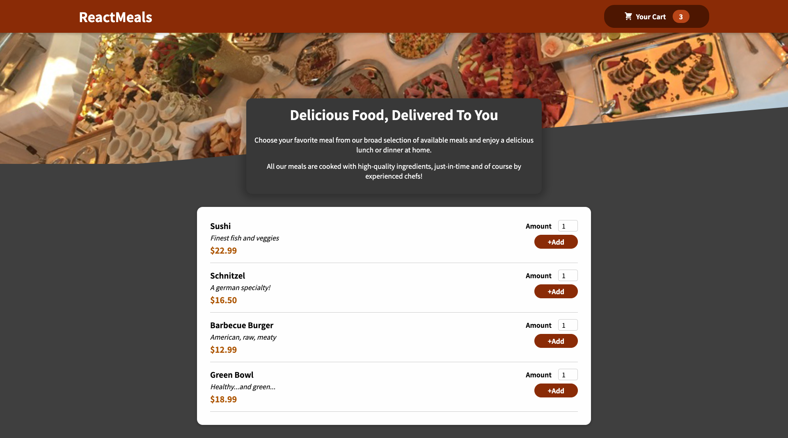

# Food Order App

## **React application representing an e-commerce.**

There is the possibility of adding and removing products from Cart.  
You can also manage the quantities for each product.

---

### **What is used?**
* The context is used to manage the CRUD actions in the Cart.  
* The css modules are used to style components.

Currently the products are retrieved from a file but axios is present for retrieval from an API.  

